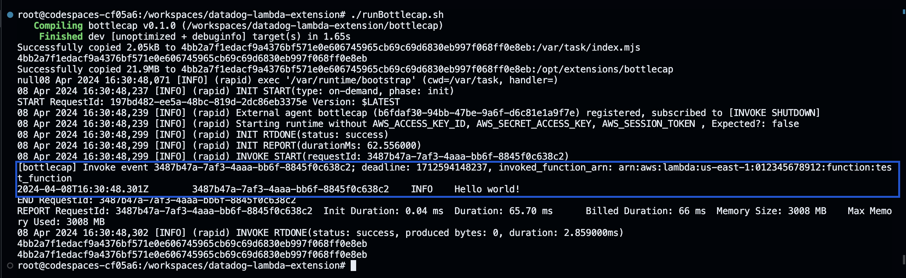

# Bottlecap

## Developing on Apple Silicon
One time setup:
1. `rustup target add aarch64-unknown-linux-gnu`
2. `brew install zig`
3. `cargo install cargo-zigbuild`

Then: `./runBottlecap.sh`

## Developing using Codespaces
Step 1: Create a codespace (code > codespaces > create codespace on main) 

Step 2: Hack in the `bottlecap` folder

Step 3: Test your change running `./runBottlecap.sh`

